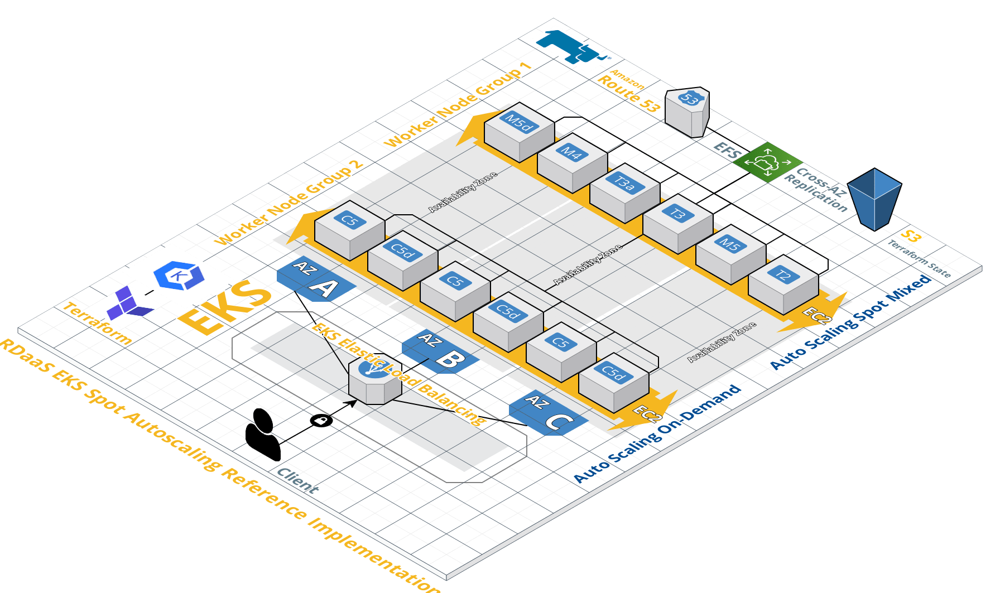

# Docker Run EKS with Auto Fleet Spotting Support

This implementation provides the steps needed to deploy one or more EKS Cluster(s) with one or more worker node groups for different projects / clusters in different regions.

Each cluster has his own subfolder, e.g. `{{CLUSTER_NAME}}` (this folder) and a README.md file (this file).

Please run `1-clone-base-module.sh` from the root folder to clone the `base` module as a new EKS cluster module.

The `1-clone-base-module.sh` script asks you about the cluster name and region and subsitutes the values in the backend.tf and cluster.tfvars files via `sed` in the newly created folder as a new cluster module.

## Prerequisites

Please make sure the following prerequsites are met:

`sed` or `gnu sed` (this was tested with the standard `sed` on Mac OSX and on Ubuntu, but it might work on Windows too)

AWS Credentials and sufficient rights to deploy EKS clusters.

If not using the default profile, please run:

```bash
export AWS_PROFILE=<your profile>
```

Note: the following tools are needed if you don't use the Dockerfile to build the Docker EKS image.

*It is highly recommended to have these tools installed on your OS as well!*

[AWS CLI](https://docs.aws.amazon.com/cli/latest/userguide/cli-chap-install.html)

[Terraform 0.12.x](https://www.terraform.io/downloads.html)

[aws-iam-authenticator](https://docs.aws.amazon.com/eks/latest/userguide/install-aws-iam-authenticator.html)

[terraform-provider-kubectl](https://github.com/gavinbunney/terraform-provider-kubectl/releases)

Get the terraform-provider-kubectl provider, please note, this is optional and is needed only for those addons which use terraform to run kubectl commands, for sure we can run `kubectl` commands without terraform, but in some cases where we want to deploy / recover a whole cluster / stack together with our apps, this might be of help, but might cause some troubles as well in some cases!):

```bash
mkdir -p ~/.terraform.d/plugins && \
    curl -Ls https://api.github.com/repos/gavinbunney/terraform-provider-kubectl/releases/latest \
    | jq -r ".assets[] | select(.browser_download_url | contains(\"$(uname -s | tr A-Z a-z)\")) | select(.browser_download_url | contains(\"amd64\")) | .browser_download_url" \
    | xargs -n 1 curl -Lo ~/.terraform.d/plugins/terraform-provider-kubectl && \
    chmod +x ~/.terraform.d/plugins/terraform-provider-kubectl
```

## Step1: Create The S3 Bucket for the backends and Keypair

The S3 Bucket is needed to store the terraform.state files and can be created as follow, depending on the region.

### Only for us-east-1

We set the BUCKET_NAME as the CLUSTER_NAME for each EKS Cluster, so that we know which cluster is using which bucket. 

```bash
# set the same cluster_name as in variables.tf
export BUCKET_NAME={{CLUSTER_NAME}}
aws s3api create-bucket --bucket {{CLUSTER_NAME}} --acl private --region {{REGION}}
# block public access
aws s3api put-public-access-block --public-access-block-configuration "BlockPublicAcls=true,IgnorePublicAcls=true,BlockPublicPolicy=true,RestrictPublicBuckets=true" --bucket $BUCKET_NAME
```

### For all other regions (eu-central-1, ca-central-1, ap-east-1 (Hongkong), ap-south-1 (Mumbai), me-south-1 (Bahrain, etc..)

Regions outside of us-east-1 require the appropriate LocationConstraint to be specified in order to create the bucket in the desired region:

```bash
# set the same cluster_name as in variables.tf
export BUCKET_NAME={{CLUSTER_NAME}}
aws s3api create-bucket --bucket {{CLUSTER_NAME}} --acl private --region {{REGION}} --create-bucket-configuration LocationConstraint={{REGION}}
# block public access
aws s3api put-public-access-block --public-access-block-configuration "BlockPublicAcls=true,IgnorePublicAcls=true,BlockPublicPolicy=true,RestrictPublicBuckets=true" --bucket $BUCKET_NAME
```

### Create the private key

This will create the private key an place it unter the {{CLUSTER_NAME}} folder.

```bash
# Create the EC2 keypair in your region
export AWS_DEFAULT_REGION={{REGION}}
aws ec2 create-key-pair --key-name {{CLUSTER_NAME}}-key --query 'KeyMaterial' --output text > ./{{CLUSTER_NAME}}/{{CLUSTER_NAME}}-key.pem
```

## Step 2: Preparation

Define the various variables for each worker group launch template in the `main.tf` file in this folder.

Note: for the `{{CLUSTER_NAME}}` cluster we need to adapt the `spot-1` and possibly the `spot-precaching` and the `monitoring` worker groups as follow:

```hcl
 worker_groups_launch_template = [
    {
      name = "spot-1"
      # 16 vcpu 32 gb (0.776 USD per Hour)
      override_instance_types = ["c5.4xlarge", "c5d.4xlarge"]
      spot_instance_pools = 2
      asg_min_size         = 2
      asg_max_size         = 30
      asg_desired_capacity = 2
      kubelet_extra_args   = "--node-labels=kubernetes.io/lifecycle=spot"
      public_ip            = true
    },
    {
      name = "spot-precaching"
      # 16 vcpu 12 gb (1 - 1.6 USD per Hour)
      override_instance_types = ["r5.4xlarge", "r5a.4xlarge", "r5ad.4xlarge", "r5d.4xlarge", "r5dn.4xlarge", "r5n.4xlarge"]
      spot_instance_pools     = 6
      asg_min_size         = 1
      asg_max_size         = 30
      asg_desired_capacity = 1
      kubelet_extra_args   = "--node-labels=kubernetes.io/lifecycle=spot,kubernetes.io/nodeselector=precaching"
      public_ip            = true
    },
    {
      name                          = "monitoring"
      # 2 vcpu 4 gb (30 USD per month)
      instance_type                 = "t3a.medium"
      additional_userdata           = "echo foo bar"
      asg_max_size         = 1
      asg_min_size         = 1
      asg_desired_capacity = 1
      kubelet_extra_args   = "--node-labels=kubernetes.io/lifecycle=monitoring"
      public_ip            = true
      # additional_security_group_ids = [aws_security_group.worker_group_mgmt_one.id]
    },
```

## Step 3: Deploy the {{CLUSTER_NAME}} EKS Cluster environment

Export the CLUSTER_NAME and run `make plan` followed by `make apply`: 

```bash
export CLUSTER_NAME={{CLUSTER_NAME}}
make plan
make apply
# if successful:
export KUBECONFIG=kubeconfig_{{CLUSTER_NAME}}
kubectl get all -A
```

## Step 4: Deploy the Cluster AutoScaler

Find the Auto Scaling Group Name for each worker group in the AWS Console or with the cli command:

```bash
export AWS_DEFAULT_REGION={{REGION}}
aws autoscaling describe-auto-scaling-groups --output table | grep $CLUSTER_NAME | grep "AutoScalingGroupName" | awk '{ print $4 }'
```

and replace them in the cluster-autoscaler-asg-name.yml file similar to this:

```bash
            - --nodes=1:30:xyz
            - --nodes=1:30:xyz
```

And finally deploy the cluster-autoscaler:

```bash
# if not done yet export CLUSTER_NAME
export CLUSTER_NAME={{CLUSTER_NAME}}

export KUBECONFIG=kubeconfig_{{CLUSTER_NAME}}
kubectl create -f cluster-autoscaler-asg-name.yml
kubectl logs -f -n kube-system cluster-autoscaler-<tab>
```

## List Clusters

```bash
aws eks list-clusters
Output:
CLUSTERS shared
```

## AddOns

The addons are provided under the `addons` folder in the root directory of this repo and are optional, depending on the project needs, e.g if EFS is needed.

Each addon has his own README.md file with a short installation guide.

Currently the following addons are implemented:

* Alb Ingress Controller
* EFS
* Jmeter Cluster
* Metrics Server
* Nginx Ingress Controller (for NLB)

## Deploy the metrics server

The metrics server can be installed with terraform after the initial cluster setup as an addon.

The manual installation guide can be found here:

https://docs.aws.amazon.com/eks/latest/userguide/metrics-server.html

In short:

```bash
wget -O v0.3.6.tar.gz https://codeload.github.com/kubernetes-sigs/metrics-server/tar.gz/v0.3.6
tar -xzf v0.3.6.tar.gz
kubectl apply -f metrics-server-0.3.6/deploy/1.8+/
kubectl get deployment metrics-server -n kube-system
k top nodes
k top pods
```

## Deploy the EFS CSI Driver

Source: https://docs.aws.amazon.com/eks/latest/userguide/efs-csi.html

```bash
kubectl apply -k "github.com/kubernetes-sigs/aws-efs-csi-driver/deploy/kubernetes/overlays/stable/?ref=master"
# Locate the VPC ID of the EKS cluster

aws eks describe-cluster --name $CLUSTER_NAME --query "cluster.resourcesVpcConfig.vpcId" --output text
Output, e.g.:
vpc-0ba6xxxxxxxxxxd0c5

# Locate the CIDR range of the EKS cluster's VPC (adapt the vpc-id with the output above)
aws ec2 describe-vpcs --vpc-ids vpc-0ba6xxxxxxxxxxd0c5 --query "Vpcs[].CidrBlock" --output text
Output vpc cidr, e.g.:
10.1.0.0/16
```

## Create EFS with the EFS module implementation

Please refer to the README file under [addons/terraform-aws-efs](../addons/terraform-aws-efs/README.md).

## Create the Nginx Ingress Controller with AWS NLB

Please refer to the README file under [addons/nginx-ingress-controller](../addons/nginx-ingress-controller/README.md).

## Testing

Deploy the provided `nginx-to-scaleout.yaml` and scale it to 10 replicas and see how the spot instances are scaled-out and decrease the number of replicas to 1 and see how the spot instances are scaled-in back (the scaled-in process may take up to 5 minutes or longer, or even don't happen, if something was not configured properly!).

```bash
k create -f ../addons/nginx-to-scaleout.yaml
k scale deployment nginx-to-scaleout --replicas=10
k get pods -w
k get nodes
```

## Clean-Up: delete clusters

Note: don't delete the prod cluster by accident 😹!

Prior to deleting a cluster, make sure all dependent resources like EFS security groups, etc (?) are dettached from the cluster.

```bash
make destroy
aws s3 rb s3://{{CLUSTER_NAME}} --force
export AWS_DEFAULT_REGION={{REGION}}
aws ec2 delete-key-pair --key-name {{CLUSTER_NAME}}-key &>/dev/null
```

## Clean-Up: Delete the ClusterAutoScalerPolicy

If not done automatically after running `terraform destroy`, please delete the ClusterAutoScalerPolicy under IAM --> Policy manually.